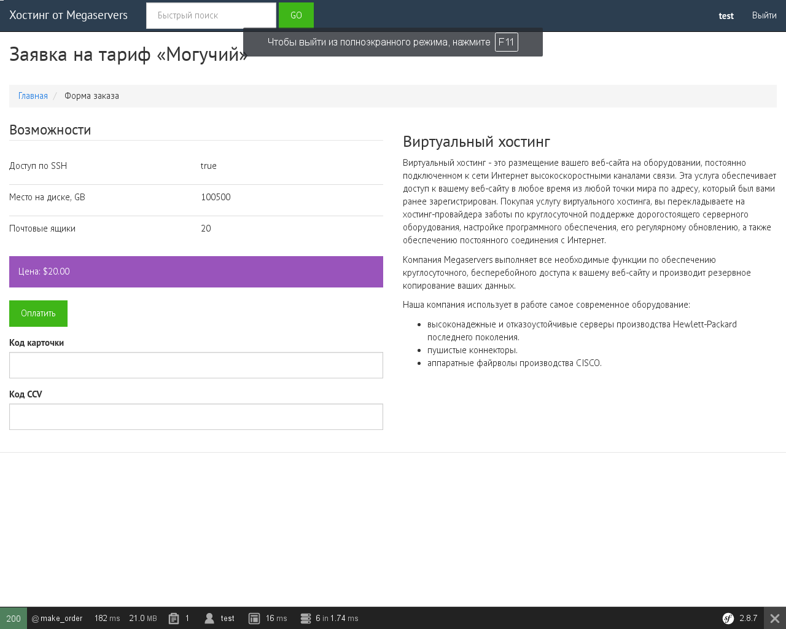

TariffBundle — Партнерская система для продажи хостинга (демо)
======

Бандл TariffBundle представляет собой демо-приложение, которое я написал
в качестве теста на одном из собеседований.

Срок исполнения 24 часа с момента получения + несколько правок впоследствии
для подготовки к публикации на GitHub.

Авторизация пользователей производится с помощью бандла FOS\UserBundle.
Оплата и обработка заявки эмулируются классами из пространства имён
TariffBundle\Utils.


## Установка
Скрипт-установщик запускает composer, а также получает нужные скрипты из GitHub.
Бандл не содержит тестов и фикстур (тестовых данных).

``` sh
$ ./install.sh

```


## Реализовано
### Админский интерфейс
* Создать Тариф (сущность Tariff): поддержка динамического добавления
Возможностей (сущность FeatureConcrete, которая расширяет Feature).
* Чтобы Возможность была доступна для добавления в Тариф, следует предварительно
её создать.
* Тип Возможности (поле value сущности FeatureConcrete) должен содержать
смешанные значения, но содержит произвольные строки — как результат экономии
времени на разработку. Может быть исправлено, к примеру, введением
новой сущности или колонки type с перечислимыми значениями.
* Просмотр созданных клиентом Заказов

### Клиентский интерфейс
* Авторизованный пользователь может отправить Заказ на доступный Тариф.
Эмулируется успешная оплата по карточке.


## Пользователи
Все шаблоны и роуты, которые вводит FOS\UserBundle, оставлены без изменений.

Добавить пользователей из командной строки:

``` sh
$ php app/console fos:user:create admin admin@example.org
$ php app/console fos:user:promote admin ROLE_ADMIN
$ php app/console fos:user:create user user@example.org
$ php app/console fos:user:promote admin ROLE_USER

```


## Скриншоты




